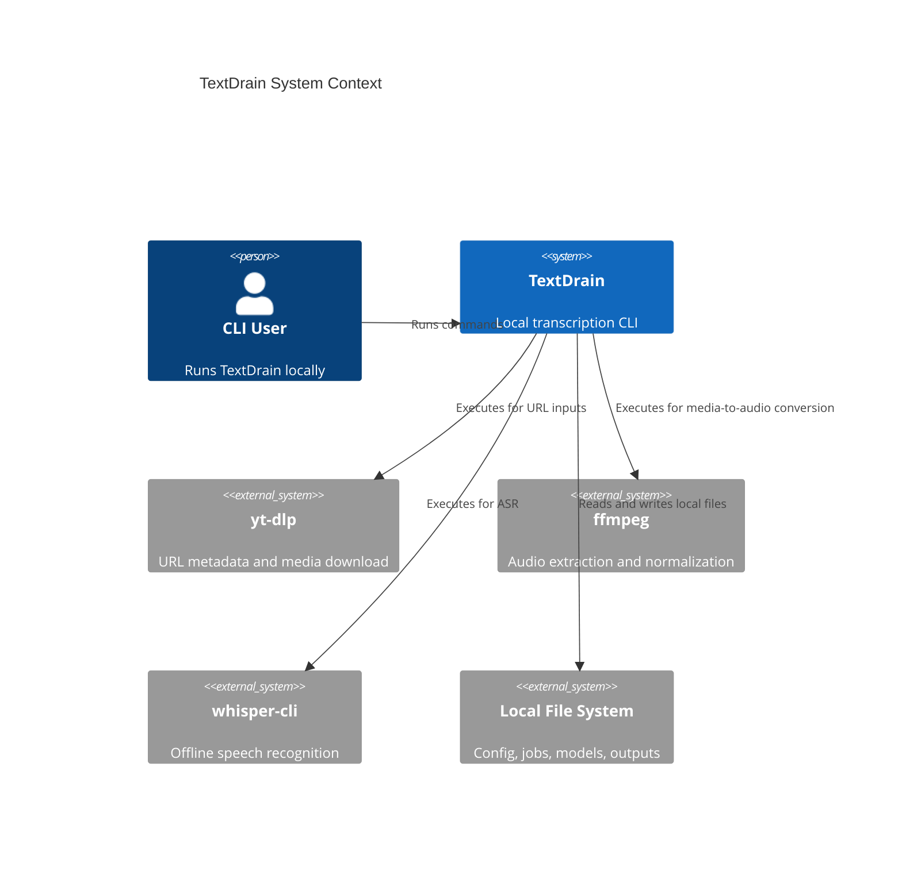
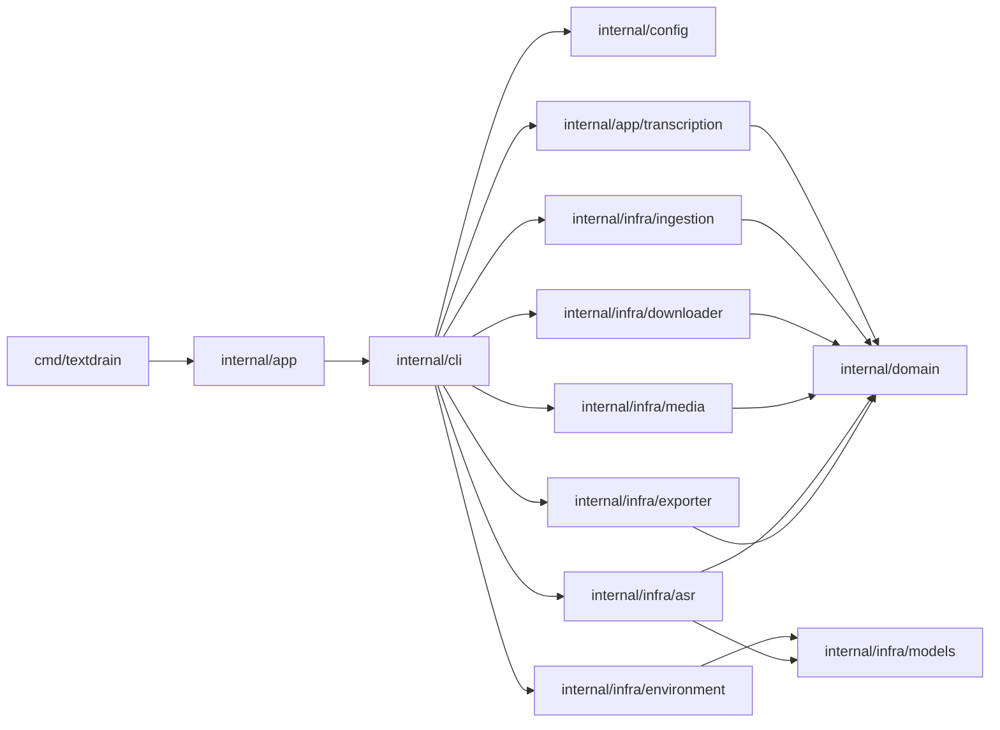
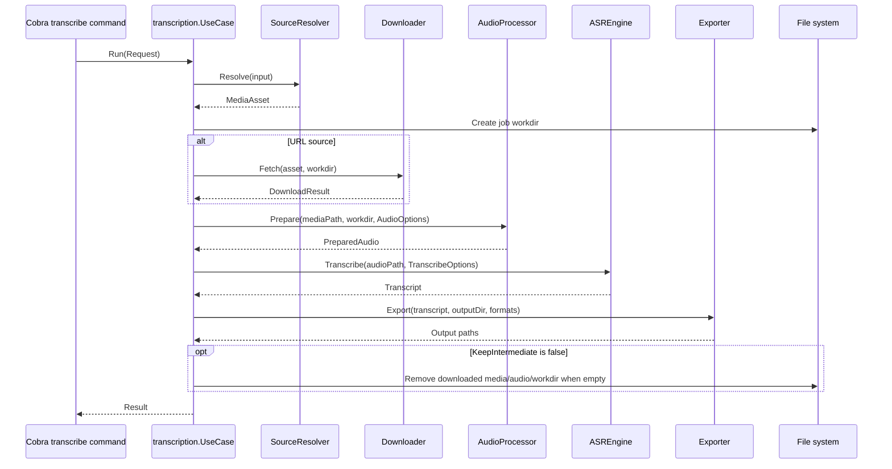

# TextDrain Architecture

Generated on 2026-04-20 from the current codebase.

## 1. Architecture Detection

TextDrain is a local-first Go CLI application. It uses Go as the orchestration layer and delegates heavy media work to established command-line tools:

- `yt-dlp` for URL metadata and media download.
- `ffmpeg` for audio extraction and normalization.
- `whisper-cli` from `whisper.cpp` for offline ASR.
- `uv` for the Python tool environment that provides `yt-dlp`.

The primary architectural style is a small hexagonal monolith:

- `internal/domain` defines the application data model and ports.
- `internal/app/transcription` implements the transcription use case against those ports.
- `internal/infra/*` implements adapters for local files, external processes, model discovery, exports, and environment checks.
- `internal/cli` provides the Cobra command surface and composes default dependencies.
- `cmd/textdrain` is the process entry point.

The codebase is intentionally not a service architecture. There is no long-lived daemon, database, HTTP API, queue, or remote service boundary in the current implementation.

## 2. Architectural Overview

TextDrain starts as a Cobra CLI process. The root command loads configuration, builds a command tree, and executes a command. The main user workflow is `transcribe`, which constructs a `transcription.UseCase` and injects concrete infrastructure adapters. The use case coordinates a linear pipeline:

1. Resolve input as either a local file or URL.
2. Download URL media when needed.
3. Prepare normalized audio.
4. Run offline ASR.
5. Export transcript files.
6. Clean intermediate files unless configured otherwise.

The most important design rule is dependency inversion. The use case depends on domain interfaces rather than concrete external tools. Concrete adapters live in `internal/infra` and are wired from the CLI layer.

## 3. Architecture Visualization

### C4 Container View



### Component View



### Transcription Data Flow



## 4. Core Components

### Entry Point: `cmd/textdrain`

`cmd/textdrain/main.go` creates a background context, constructs `app.App`, passes `os.Args[1:]`, and exits with the CLI error code. It deliberately contains no business logic.

### Application Bootstrap: `internal/app`

`internal/app.App` owns process-level defaults:

- Default filesystem paths from `config.DefaultPaths`.
- Default config from `config.Default`.
- Logger from `infra/logging`.
- CLI UI bound to `stdout` and `stderr`.

`Run` loads configuration once, builds the root Cobra command, sets arguments, executes it, and prints formatted errors.

### CLI Layer: `internal/cli`

The CLI layer is the user-facing adapter. It defines commands, parses flags, maps command errors to exit codes, and wires concrete infrastructure for the default transcriber.

Commands:

- `transcribe <url-or-path>`: runs the media-to-transcript pipeline.
- `doctor`: checks tool availability, versions, configured paths, and model presence.
- `models --list`: lists supported local model files.
- Hidden `paths`: prints resolved configuration/cache/job/model paths.

The CLI also contains a test seam: `RootOptions.Transcriber` lets tests inject a fake use case.

### Domain Layer: `internal/domain`

The domain package contains stable vocabulary and ports:

- Source and output enums: `SourceType`, `OutputFormat`, `JobStatus`.
- Data structures: `MediaAsset`, `DownloadResult`, `PreparedAudio`, `Transcript`, `TranscriptSegment`, `TranscriptEngine`.
- Ports: `SourceResolver`, `Downloader`, `AudioProcessor`, `ASREngine`, and `Exporter`.

The domain package has no dependency on Cobra, external commands, config parsing, or filesystem layout beyond plain data fields.

### Transcription Use Case: `internal/app/transcription`

`UseCase` is the application core. It owns pipeline ordering, stage reporting, metadata enrichment, stage-aware error wrapping, and cleanup policy.

Injected dependencies:

- `domain.SourceResolver`
- `domain.Downloader`
- `domain.AudioProcessor`
- `domain.ASREngine`
- `domain.Exporter`
- optional `StatusReporter`

The use case validates that required dependencies exist before executing. Failures are wrapped in `StageError` so the CLI can provide targeted user advice.

### Configuration: `internal/config`

Configuration is intentionally small and hand-parsed:

- Optional config file: `~/.config/textdrain/config.toml`.
- Defaults: `model=small`, `language=auto`, all four output formats, no intermediate retention.
- Configured directories: model directory and jobs directory under `~/.cache/textdrain` by default.
- Override support exists in `config.Overrides`, although current CLI flag handling applies command options primarily through the transcription request.

The TOML parser supports only flat `key = value` assignments. Tables are rejected explicitly.

### Infrastructure Adapters: `internal/infra`

`internal/infra/ingestion` resolves input into `domain.MediaAsset`. Local files are validated for regular-file and readability properties. URL inputs must be HTTP or HTTPS. Job IDs combine source type, sanitized title, timestamp, identity hash, and random suffix.

`internal/infra/downloader` shells out to `yt-dlp`. It first reads JSON metadata with `--dump-single-json`, then downloads `bestaudio/best` with fallback to `best`. Downloads are staged in a temporary directory and moved into the job workdir.

`internal/infra/media` shells out to `ffmpeg`. It converts media into mono 16 kHz `pcm_s16le` WAV by default. Writes are staged through a temporary file and renamed into place.

`internal/infra/asr` shells out to `whisper-cli`. It resolves model names through `internal/infra/models`, runs `whisper-cli` with JSON output enabled, parses the generated JSON transcript, and records ASR metadata.

`internal/infra/exporter` writes transcript artifacts. It supports `txt`, `srt`, `vtt`, and `json`, uses atomic temp-file then rename writes, writes fixed transcript filenames inside a resolved output directory, and emits a `metadata.json` file for stable export metadata.

`internal/infra/environment` implements `doctor` checks. It validates `yt-dlp`, `ffmpeg`, `whisper-cli`, and model candidates.

`internal/infra/models` discovers `.gguf` and `.bin` model files and expands short model names such as `small` into candidate file names.

`internal/infra/logging` currently provides simple structured error logging for bootstrap failures.

## 5. Layers and Dependency Rules

The implemented dependency direction is:

```text
cmd/textdrain
  -> internal/app
      -> internal/cli
      -> internal/config
      -> internal/infra/logging

internal/cli
  -> internal/app/transcription
  -> internal/config
  -> internal/domain
  -> internal/infra/*

internal/app/transcription
  -> internal/domain

internal/infra/*
  -> internal/domain when implementing workflow ports
  -> internal/config where environment checks need config/path data
```

Rules to preserve:

- Domain types and interfaces must remain independent of CLI, configuration, and infrastructure packages.
- Use cases should depend on domain interfaces, not concrete external command adapters.
- Infrastructure may depend on domain to implement ports.
- CLI may compose concrete adapters but should not own transcription pipeline ordering.
- `cmd/textdrain` should remain a thin entry point.

No circular package dependencies are present in the current structure.

## 6. Data Architecture

TextDrain is file-oriented and has no database. The primary data structures are transient Go values and files on disk.

### Domain Data Shapes

- `MediaAsset`: normalized source representation. For local sources, it includes a concrete media path. For URL sources, it initially contains metadata and workdir; after download it includes a media path.
- `PreparedAudio`: normalized ASR-ready audio file and technical audio metadata.
- `Transcript`: ASR output with language, full text, time-bounded segments, engine metadata, and metadata map.
- `TranscriptSegment`: segment index, millisecond offsets, text, and optional confidence.

### Filesystem Layout

Default paths:

```text
~/.config/textdrain/config.toml
~/.cache/textdrain/jobs/<job-id>/
~/.cache/textdrain/models/
outputs/<title>-<id>/
```

The jobs directory stores temporary downloaded media, normalized audio, and ASR scratch directories. Exported transcripts are written to an explicit `--output` root with one resolved media subdirectory beneath it, or to `outputs/<title>-<id>/` for URL inputs and `outputs/<title>/` for local files.

### Transformations

Input flows through these transformations:

```text
raw CLI argument
  -> MediaAsset
  -> downloaded/local media path
  -> PreparedAudio
  -> Transcript
  -> transcript artifact files
```

Metadata is accumulated rather than replaced. The use case merges ASR metadata, source metadata, job ID, source details, media path, audio path, and workdir before export.

## 7. Cross-Cutting Concerns

### Authentication and Authorization

There is no authentication or authorization layer. TextDrain is a local CLI and relies on local OS permissions for files and executable access.

### Error Handling

Errors are categorized in layers:

- Infrastructure adapters return contextual errors, often including a trimmed first or relevant stderr line from external tools.
- `transcription.UseCase` wraps stage failures in `StageError`.
- `internal/cli` converts errors to `ExitError` with user-facing stage, type, reason, advice, and exit code.

Exit codes:

- `0`: success.
- `2`: parameter or configuration error.
- `3`: dependency error.
- `4`: runtime error.

### Resilience

Implemented resilience is local and pragmatic:

- Context cancellation is checked before and after external command execution.
- `doctor` uses a timeout for version checks.
- `yt-dlp` retries download format selection from `bestaudio/best` to `best`.
- Temporary files and directories are used before final moves.

There are no circuit breakers, distributed retries, or network service fallbacks.

### Logging and Monitoring

Runtime observability is CLI-oriented:

- `statusWriter` prints stage transitions as `stage=<STATUS>`.
- Error formatting provides structured user-facing diagnostics.
- `logging.Logger` is used during app-level config load failures.

There is no metrics, tracing, or telemetry system.

### Validation

Validation is distributed by responsibility:

- CLI validates argument counts, language flags, empty model flag values, and command-specific positional arguments.
- Config validates supported languages, output formats, model names, and directories.
- Ingestion validates local file regularity/readability and URL scheme/host.
- Media and ASR adapters validate file paths and model paths before running external commands.
- Exporter validates output formats and default output directory derivation.

### Configuration Management

Configuration precedence documented by README is CLI flags, config file, then defaults. Implementation details:

- `config.Load` merges defaults, flat TOML config, then explicit `config.Overrides`.
- `transcribe` flags are passed through `transcription.Request`.
- There is no secret management or feature flag system.

## 8. Service Communication Patterns

TextDrain does not communicate with internal services. Integration boundaries are process execution and filesystem IO:

- Synchronous `exec.CommandContext` calls to `yt-dlp`, `ffmpeg`, and `whisper-cli`.
- JSON over stdout or files for `yt-dlp` metadata and `whisper-cli` transcript output.
- Local file reads/writes for media, models, config, and transcript artifacts.

All command integrations are blocking and scoped to the current CLI process context.

## 9. Go-Specific Patterns

### Package Organization

The project follows idiomatic Go package boundaries:

- `cmd/<binary>` for the executable.
- `internal/` for all non-public application packages.
- Small packages named by responsibility.
- Interfaces placed near domain vocabulary because they are stable application ports.

### Dependency Injection

Dependency injection is constructor-based:

```go
transcription.NewUseCase(transcription.Dependencies{
    Resolver:       ingestion.NewResolver(cfg.JobsDir, language),
    Downloader:     downloader.NewYTDLP(),
    AudioProcessor: media.NewFFmpeg(),
    ASREngine:      asr.NewWhisperCLI(cfg.ModelDir),
    Exporter:       exporter.New(),
    Reporter:       statusWriter{out: out},
})
```

Tests use fake implementations of the same interfaces to exercise the use case without running external tools.

### Error Wrapping

The code consistently wraps errors with `%w`, enabling `errors.Is` and `errors.As` checks in tests and CLI classification.

### Context Propagation

The application starts with `context.Background()`, Cobra passes the context into commands, and adapters use `exec.CommandContext` for cancellable external commands.

### Atomic File Writes

Download, media preparation, and export paths use temporary files or directories followed by rename/move operations. This keeps partially written outputs from becoming final artifacts.

## 10. Implementation Patterns

### Port and Adapter Pattern

Domain interfaces define what the use case needs. Adapters implement external details:

```go
type ASREngine interface {
    Transcribe(ctx context.Context, audioPath string, opts TranscribeOptions) (Transcript, error)
}
```

`infra/asr.WhisperCLI` implements that port by validating input, resolving the model path, running `whisper-cli`, and parsing its JSON output.

### Stage-Oriented Pipeline

The transcription pipeline is deliberately sequential. Each stage reports status before work and wraps failures with the stage that failed. This makes CLI errors explainable without coupling the CLI to all adapter internals.

### Metadata Accumulation

Metadata maps are used as an extension surface for export and diagnostics. Source metadata, ASR metadata, job metadata, and audio metadata are merged before output generation.

### Filename and Path Sanitization

Adapters sanitize job IDs and filenames independently. This prevents external titles and URLs from directly controlling filesystem names.

### External Command Adapter Construction

Adapters provide default constructors and test constructors:

- `NewYTDLP()` and `NewYTDLPWithBinary(binary)`.
- `NewFFmpeg()` and `NewFFmpegWithBinary(binary)`.
- `NewWhisperCLI(modelDir)` and `NewWhisperCLIWithBinary(binary, modelDir)`.

This keeps production wiring simple while allowing tests to run fake executables.

## 11. Testing Architecture

The project uses Go's standard `testing` package.

Current coverage patterns:

- Domain tests validate core type behavior.
- Config tests cover defaults, flat TOML parsing, overrides, and validation.
- CLI tests cover command surface, flag parsing, error formatting, exit classification, `doctor`, `models`, and output summaries.
- Use case tests cover local and URL transcription flows, status reporting, cleanup, stage wrapping, and missing dependency/model errors.
- Infrastructure adapter tests use temporary files, fixtures, and fake shell scripts to validate command argument construction and parsing without requiring real media tooling.
- Exporter tests cover all supported formats, default output locations, fallback naming, invalid formats, and cancellation.

Test fixtures live under `testdata/`, including sample command JSON and sample media.

Testing guidance:

- Keep use case tests adapter-free with fakes.
- Test external command adapters with fake binaries where possible.
- Use `t.TempDir()` for filesystem effects.
- Add integration tests that invoke real external tools only when they can be made optional or environment-gated.

## 12. Deployment Architecture

TextDrain deploys as a local CLI binary. There is no server deployment topology.

Runtime requirements:

- Go 1.24+ for development and build.
- Python 3.12+ and `uv` for the Python tool environment.
- `yt-dlp`, commonly via `uv sync` and `uv run`.
- `ffmpeg` available on `PATH`.
- `whisper-cli` available on `PATH`.
- A local `.gguf` or `.bin` whisper.cpp model file.

Build:

```bash
go build -o bin/textdrain ./cmd/textdrain
```

Common development execution:

```bash
uv run go run ./cmd/textdrain doctor
uv run go run ./cmd/textdrain transcribe ./samples/zh_prompt.wav
```

The `doctor` command is the deployment readiness check for local machines.

## 13. Extension and Evolution Patterns

### Add a New Export Format

1. Add a new `domain.OutputFormat` constant.
2. Allow it in `config.Config.Validate`.
3. Render it in `infra/exporter.render`.
4. Add exporter tests for content, filename, and unsupported-format behavior.
5. Update README and this document.

### Add a New ASR Engine

1. Implement `domain.ASREngine`.
2. Keep model/path validation inside the adapter.
3. Return `domain.Transcript` with normalized segments and engine metadata.
4. Add a constructor to the adapter package.
5. Update CLI composition when engine selection exists.

### Add New Input Types

1. Extend `domain.SourceType` only if the distinction affects downstream behavior.
2. Update `infra/ingestion.Resolver` to normalize the input into `MediaAsset`.
3. Add or extend a downloader/preparer adapter if the source needs extra acquisition.
4. Preserve the use case boundary: the use case should coordinate source categories, not parse raw input formats.

### Add Configuration Keys

1. Extend `config.Config`, `config.Overrides`, and `fileConfig`.
2. Parse and validate the key in `config.go`.
3. Apply it in `applyFileConfig` and `applyOverrides`.
4. Decide whether CLI flags should pass it through config overrides or command request options.
5. Add config tests and README examples.

### Add More Languages

1. Update CLI `validateLanguage`.
2. Update `config.Config.Validate`.
3. Update `infra/asr.validateLanguage`.
4. Add tests in all three layers.
5. Confirm `whisper-cli` accepts the intended language code.

## 14. Architectural Decision Records

### ADR 1: Local-First CLI

Context: The product goal is offline transcription of local media and URL-backed media.

Decision: Implement TextDrain as a local CLI that orchestrates local tools rather than a hosted service.

Consequences:

- Positive: no server infrastructure, no transcript data leaves the machine by default, straightforward local debugging.
- Negative: users must install and maintain local external tools and model files.

### ADR 2: External Tools Over Embedded Media/ASR Libraries

Context: Media download, audio conversion, and ASR are complex domains with mature local tools.

Decision: Shell out to `yt-dlp`, `ffmpeg`, and `whisper-cli`.

Consequences:

- Positive: smaller Go codebase, mature codec/platform support, easy tool upgrades.
- Negative: runtime depends on `PATH`, command-line compatibility, and external stderr formats.

### ADR 3: Domain Ports Around the Pipeline

Context: The pipeline has clear stages that are easy to fake in tests.

Decision: Put stage contracts in `internal/domain` and inject adapters into `transcription.UseCase`.

Consequences:

- Positive: use case tests do not need real external tools; new adapters can be introduced without rewriting orchestration.
- Negative: some domain structs include technical fields because the domain is a workflow domain rather than a pure business model.

### ADR 4: Flat Config Parser

Context: MVP configuration is small and stable.

Decision: Use a narrow custom parser for flat TOML-like keys instead of adding a TOML dependency.

Consequences:

- Positive: fewer dependencies and predictable supported syntax.
- Negative: tables and richer TOML features are not supported.

## 15. Architecture Governance

Automated governance currently comes from package boundaries and tests rather than specialized architecture tooling.

Practices to preserve:

- Run `go test ./...` before merging behavioral changes.
- Keep new orchestration logic in `internal/app/transcription` or a new use case package.
- Keep external process details in `internal/infra`.
- Keep CLI user interaction and exit-code policy in `internal/cli`.
- Avoid adding imports from `internal/infra` into `internal/domain` or `internal/app/transcription`.

Recommended future checks:

- Add a lightweight package dependency test or script if the architecture grows.
- Add `go vet ./...` and formatting checks to CI.
- Gate any real-tool integration tests behind explicit environment variables.

## 16. Blueprint for New Development

### Workflow for New Features

1. Identify the layer affected by the feature.
2. Add or update domain types/interfaces only when the use case contract changes.
3. Implement orchestration in a use case package.
4. Implement external integration in `internal/infra/<concern>`.
5. Wire the adapter in `internal/cli`.
6. Add tests at the narrowest useful boundary first, then broaden if behavior crosses layers.
7. Update README and `ARCHITECTURE.md` when command surface, config, or boundaries change.

### Placement Guide

- New command: `internal/cli`.
- New workflow: `internal/app/<workflow>`.
- New port or shared workflow data type: `internal/domain`.
- New external tool or filesystem adapter: `internal/infra/<concern>`.
- New config key or path rule: `internal/config`.
- New executable entry point: `cmd/<name>`.

### Common Pitfalls

- Do not call `yt-dlp`, `ffmpeg`, or `whisper-cli` directly from the use case.
- Do not place user-facing Cobra code in infrastructure adapters.
- Do not let config parsing know about pipeline stage ordering.
- Do not write final artifacts directly without a temp-file strategy.
- Do not add language or format support in only one layer; validation exists in multiple places.
- Do not add tests that require real external binaries unless they are explicitly optional.

### Update Policy

Refresh this document when any of the following changes:

- A new command, workflow, adapter, output format, or source type is added.
- Configuration semantics or precedence changes.
- External tool integration changes materially.
- Package boundaries or dependency direction changes.
- Deployment/runtime requirements change.
